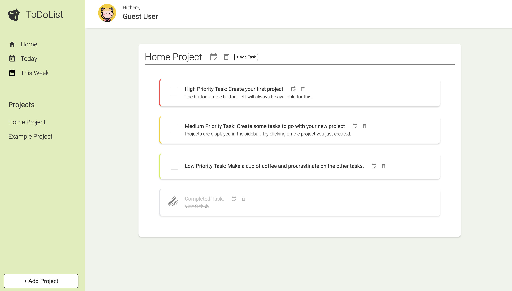

# The Odin Project JavaScript

;

## Project: Todo List

A dynamically created _ToDo_ list with **vanilla JavaScript**.
The project is from The Odin Project [curriculum](https://www.theodinproject.com/paths/full-stack-javascript/courses/javascript/lessons/todo-list).

🔗 **Live preview** of the project is

### Overview

#### **Features:**

-   You can **add**, **delete** and **edit** projects and tasks.
-   You can write **description** for the task, choose its **date** and **priority**.
-   You can **view** task information.
-   You can see which tasks are due **today** or **within a week**.
-   You can **mark** tasks as completed.
-   You can see what tasks are **important** and already **completed**.

#### **Tools:**

-   VS Code
-   iTerm
-   Git and GitHub
-   Webpack Module Bundler
-   ESLint + Airbnb JavaScript Style Guide
-   Prettier Code Formatter

#### **Third party code:**

-   [Google Fonts](https://fonts.google.com/)
-   [date-fns Library](https://date-fns.org/)
